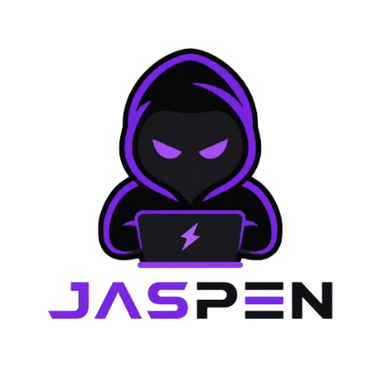

# Jaspen Website

### Website Jasa Pentester & Security Audit Berbasis Bukti

<p align="center">
  
</p>


Jaspen adalah website layanan jasa pentester dan security audit berbasis bukti untuk membantu bisnis menemukan celah keamanan pada web application, API, source code, dan workflow CI/CD.

Website ini berfungsi sebagai landing page resmi Jaspen untuk memperkenalkan layanan, menjelaskan output pentest, menampilkan validasi publik, menyediakan sample report, dan menerima request konsultasi scope pentest.

---

## Daftar Isi

* [Tentang Jaspen](#tentang-jaspen)
* [Disclaimer Legal](#disclaimer-legal)
* [Layanan](#layanan)
* [Output Pentest](#output-pentest)
* [Fitur Website](#fitur-website)
* [Struktur Project](#struktur-project)
* [Cara Menjalankan](#cara-menjalankan)
* [Kontak](#kontak)
* [Catatan Keamanan](#catatan-keamanan)
* [License](#license)

---

## Tentang Jaspen

Jaspen membantu bisnis dan tim engineering melakukan audit keamanan dengan pendekatan manual, evidence-first, dan berorientasi pada risiko nyata.

Jaspen dibangun oleh Muhamad Arga Reksapati, security researcher dengan pengalaman di bug bounty, source-code audit, responsible disclosure, dan advisory credit pada project open-source.

Fokus utama Jaspen:

* Web application pentest
* API security assessment
* Source-code audit
* Bug bounty style review
* CI/CD dan supply-chain security review
* Report dan retest setelah patch

---

## Disclaimer Legal

Jaspen hanya menerima pengujian keamanan pada target yang memiliki otorisasi sah.

Pengujian hanya dilakukan setelah scope disepakati secara tertulis, termasuk batasan teknis, environment pengujian, metode validasi, dan aturan keamanan yang berlaku.

### Penggunaan yang diperbolehkan

* Pentest pada aplikasi milik sendiri
* Audit keamanan dengan izin tertulis
* Source-code review pada repository yang diberikan secara sah
* Review CI/CD dan pipeline milik organisasi terkait
* Validasi patch setelah perbaikan vulnerability

### Penggunaan yang tidak diperbolehkan

* Pengujian tanpa izin
* Eksploitasi terhadap sistem pihak ketiga
* Pengambilan data sensitif di luar kebutuhan bukti
* Destructive testing tanpa persetujuan
* Aktivitas yang melanggar hukum atau scope engagement

Dengan menggunakan layanan Jaspen, klien menyatakan bahwa target yang diajukan berada dalam otorisasi dan tanggung jawab yang sah.

---

## Layanan

### Web & API Pentest

Pengujian keamanan untuk web application dan API dengan fokus pada:

* Autentikasi
* Otorisasi
* IDOR
* Injection
* File upload
* Session management
* Business logic flaw
* Access control issue

### Source Code Audit

Audit kode manual untuk menelusuri alur data, validasi, permission check, state, cache, dan sink sensitif yang sering tidak terdeteksi scanner.

### Bug Bounty Style Review

Assessment berbasis impact dengan fokus pada temuan yang:

* Reproducible
* Reachable
* Evidence-backed
* Memiliki risiko keamanan nyata
* Dapat ditindaklanjuti oleh tim teknis

### CI/CD & Supply Chain Review

Review workflow dan pipeline untuk menemukan risiko pada:

* GitHub Actions
* Secret handling
* Dependency path
* Artifact signing
* Release workflow
* Build trust chain
* Supply-chain exposure

### Report & Retest

Penyusunan laporan teknis dan validasi ulang setelah patch untuk memastikan finding benar-benar tertutup.

---

## Output Pentest

Setiap engagement Jaspen berfokus pada output yang bisa langsung ditindaklanjuti.

Output yang dapat diberikan:

* Executive summary
* Technical report
* Severity dan prioritas remediation
* Langkah reproduksi
* Proof of Concept aman
* Evidence screenshot atau request-response
* Root cause analysis
* Rekomendasi fix
* Retest report setelah patch

---

## Fitur Website

Website ini memuat beberapa section utama:

* Hero section untuk positioning jasa pentest
* Penjelasan layanan
* Output pentest
* Paket dan scope engagement
* Prestasi dan validasi publik
* Recognition dari program keamanan
* Cara kerja audit
* Keamanan dan etika pengujian
* Sample report section
* FAQ
* Form konsultasi scope pentest
* Kontak email dan WhatsApp
* Privacy Policy
* Terms of Engagement

---

## Tech Stack

Website ini dibuat sebagai static website menggunakan:

* HTML
* CSS
* JavaScript
* Static assets

Website tidak membutuhkan backend khusus untuk tampilan utama.

Form kontak pada versi ini diarahkan untuk membuka draft email atau kontak WhatsApp agar request scope dapat langsung dikirim ke pemilik layanan.

---

## Struktur Project

```text
jaspen_website/
├── index.html
├── style.css
├── script.js
├── favicon.ico
├── assets/
│   ├── og-image.png
│   └── proofs/
│       ├── anthropic-bounty-sanitized.webp
│       ├── google-bughunters-profile.webp
│       ├── google-reward-proof.webp
│       └── curl-advisory-proof.webp
└── README.md
```

---

## Cara Menjalankan

Clone repository:

```bash
git clone https://github.com/areksaxyz/jaspen-website.git
cd jaspen-website
```

Buka langsung file berikut di browser:

```text
index.html
```

Atau jalankan local server sederhana:

```bash
python3 -m http.server 8000
```

Kemudian buka:

```text
http://localhost:8000
```

---

## Kontak

Untuk konsultasi scope pentest atau audit keamanan:

* Email: [m.argareksapati21@gmail.com](mailto:m.argareksapati21@gmail.com)
* WhatsApp: 6281818266692
* GitHub: https://github.com/areksaxyz

---

## Catatan Keamanan

Beberapa proof image pada website menggunakan versi sanitized. Detail teknis report private, metadata sensitif, dan informasi non-public tidak dipublikasikan.

Pengujian keamanan hanya dilakukan pada target yang memiliki otorisasi sah dan scope tertulis yang disepakati.

---

## License

Copyright © 2026 Jaspen.

Seluruh konten, desain, proof, dan aset visual pada repository ini digunakan untuk website resmi Jaspen.

Penggunaan ulang konten, proof, screenshot, atau aset visual tanpa izin tidak diperbolehkan.
